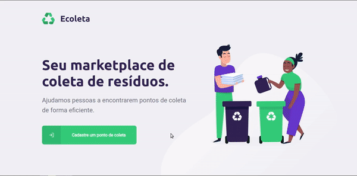

<h1 align="center">
  
</h1>

# Ecoleta
Project carried out for Next Level Week #1 from [@Rocketseat](https://github.com/rocketseat), taught by [@diego3g](https://github.com/diego3g).

  

  
	
  

  

  
<a aria-label="Completo">
    </img>
  </a>
  

### ✨ [Demo](https://ecoleta-web.netlify.app)

<h2 align='center'>
      
</h2>      
<h2 align='center'>
      
	 
	
</h2>

## :notebook: Getting Started
1. Clone this repository
2. `cd server`
3. `npm install`
4. Rename `.env.template` to `.env`.
5. Add your host url.
6. `npm run knex:migrate`
7. `npm run knex:seed`
8. `cd ../web`
9. `npm install`
10. `cd ../mobile`
11. `npm install`
12. `cd ..`
13. To start server
   1. `cd server`
   2. `npm run dev`
14. To start frontend
    1. `cd frontend`
    2. `npm start`
15. To start mobile
    1. `cd mobile`
    2. `npm start`
16. Enjoy!

## 🤝 Contributing

Contributions, issues and feature requests are welcome! Feel free to check [issues page](https://github.com/weltonfelix/ecoleta/issues). 
- Make a fork;
- Create a branck with your feature: `git checkout -b my-feature`;
- Commit changes: `git commit -m 'feat: My new feature'`;
- Make a push to your branch: `git push origin my-feature`.

After merging your receipt request to done, you can delete a branch from yours.

## Show your support

Give a ⭐️ if this project helped you!

## 📝 License

This project is under the MIT license. See the [LICENSE](LICENSE.md) for details.

***
Made with ♥ by Welton Felix :wave: [Get in touch!](mailto:contato.weltonf@gmail.com)
